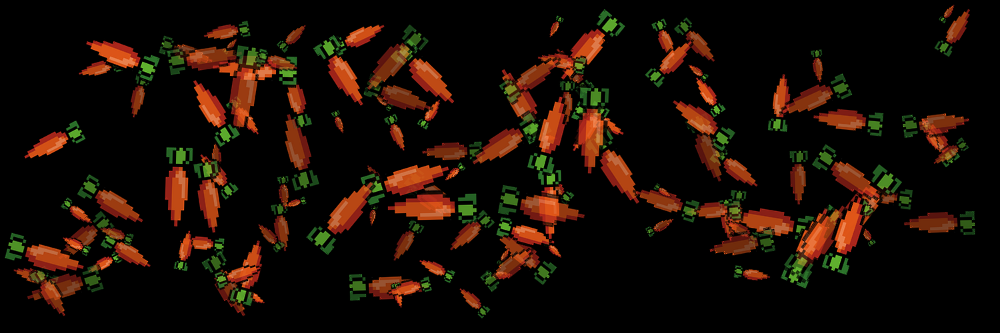
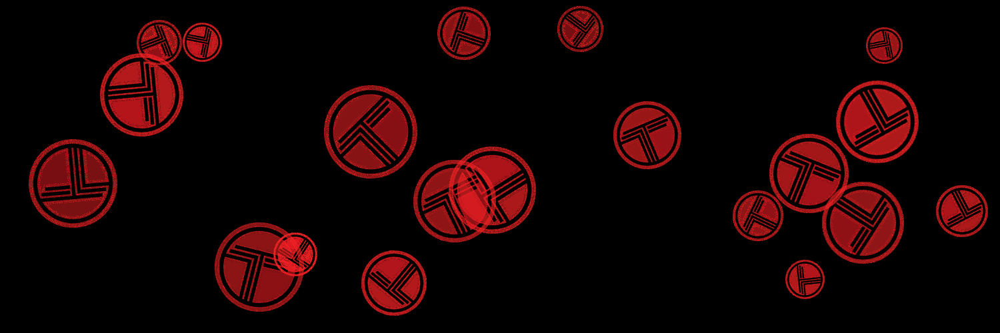
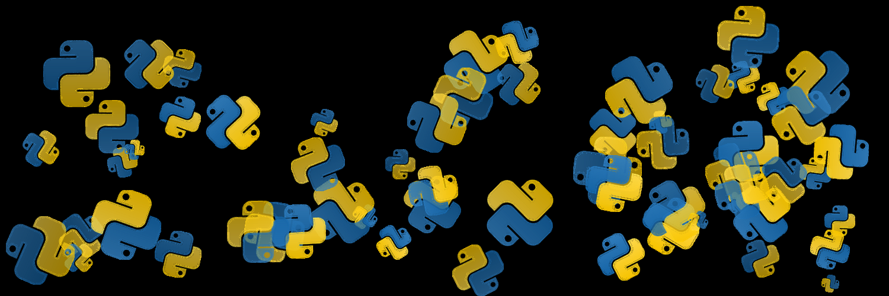
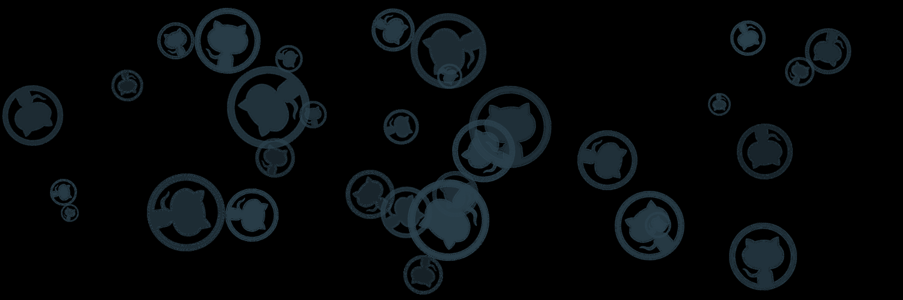


# Background Generator


  
A Python-based tool that generates dynamic mosaic backgrounds by manipulating and compositing image tiles with random variations in size, rotation, and transparency.

## Description

This project creates unique, visually interesting background images by taking a base tile image and generating a mosaic pattern with the following features:

- Random scaling of tiles (10% to 80% of original size)
- Random rotation (0-360 degrees)
- Variable transparency levels
- Intelligent positioning within canvas boundaries
- High-quality image processing using PIL/Pillow

The output is a 1500x500 pixel PNG image with a unique timestamp-based filename.

## Requirements

- Python 3.11 or higher
- Pillow 11.2.1 or higher

## Installation

1. Clone this repository:

   ```bash
   git clone https://github.com/topogoogles/background-generator.git
   cd background-generator
   ```

2. Create and activate a virtual environment:

   ```bash
   python -m venv .venv
   source .venv/bin/activate # On Windows, use: .venv\Scripts\activate
   ```

3. Install dependencies:

   ```bash
   pip install -r requirements.txt
   ```

## Usage

1. Ensure you have a base tile image (300x300 pixels, PNG format with transparency) in the `assets` directory.
2. Run the generator:

   ```bash
   python background-generator.py
   ```

The script will:

- Use the base tile image from `assets/carrot.png`
- Generate a mosaic with 128 randomly placed and transformed tiles
- Save the output as a PNG file in the `creations` directory with a timestamp-based filename

## Project Structure

```text
background-generator/
├── assets/ # Directory for base tile images
│ ├── carrot.png # Base tile image (300x300px)
│ ├── github.png # Base tile image (300x300px)
│ ├── python.png # Base tile image (300x300px)
│ └── trakt_tv.png # Base tile image (150x150px)
├── creations/ # Output directory for generated mosaics
├── background-generator.py # Main script
├── pyproject.toml # Project configuration and dependencies
└── README.md # This file
```
## Customization

You can modify the following parameters in `background-generator.py`:

- Canvas size (default: 1500x500)
- Number of tiles (default: 128)
- Scale range (default: 0.1 to 0.8)
- Rotation range (default: 0 to 360 degrees)
- Transparency range (default: 50% to 100%)

## Example Generated Backgrounds

<table>
  <tr>
    <td></td>
    <td></td>
    <td></td>
    <td></td>
  </tr>
</table>
  
## License

This project is licensed under the MIT License. See the [LICENSE](LICENSE) file for details.  

## Contributing

Contributions are welcome! Please feel free to submit a Pull Request.
